<div align="center">
  
  <h1>mclog2event</h1>
  <p><em></em></p>
</div>

`mclog2event` is a lightweight little tool that watches your Minecraft server logs and turns them into events — no mods, no datapacks, no hacks needed. Just tail your log file, catch stuff like player joins, chats, or custom modpack messages, and send it all to a webhook of your choice.

Great for automations, fun Discord bots, or just keeping an eye on what’s happening on your server without touching the game itself.
 
[](https://github.com/AlexisHutin/mclog2event/actions/workflows/ci-cd.yml)

---

## ✨ Features

- 🔁 **Live log watching** – Monitors your Minecraft log file in real-time.
- 🧠 **Custom event matching** – Define your own regex patterns to extract exactly what you need.
- 📤 **Webhook output** – Sends structured event data to any URL (Discord, custom apps, etc).
- ⚙️ **Easy config** – Everything runs off a simple `events.yml` file.

---

## 🔄 Workflow Overview

```mermaid
sequenceDiagram
    participant MinecraftLog as Minecraft Log 📄
    participant LogWatcher as Log Watcher 👀
    participant Matcher as Matcher 🔍
    participant EventPayload as Event Payload 📦
    participant WebhookPusher as Webhook Pusher 📬

    MinecraftLog->>LogWatcher: Log entry emitted
    LogWatcher->>Matcher: Passes log line
    Matcher->>Matcher: Check regex match
    alt Match found
        Matcher->>EventPayload: Extract data from regex groups
        EventPayload->>WebhookPusher: Send payload
        WebhookPusher->>WebhookPusher: Send to configured URL
    else No match
        Matcher-->>LogWatcher: Ignore
    end
```



---

## 🛠️ Config

You set it up using environment variables:

| Env Var             | What it does                              | Required |
|---------------------|--------------------------------------------|----------|
| `LOG_FILE_PATH`     | Path to the log file to watch             | ✅ Yes   |
| `WEBHOOK_URL`       | Where to send the event (Discord, etc)    | ✅ Yes   |
| `EVENT_CONFIG_PATH` | Path to your `events.yml` config          | ✅ Yes   |

---

### Example `events.yml`

Here’s what an event config file looks like. You can define as many events as you want, using regex with named capture groups like `(?P<player>\w+)`.

```yaml
events:
  - event_type: "player_join"
    pattern: '(?P<player>\w+) joined the game'
    description: "A player joined the server."

  - event_type: "player_leave"
    pattern: '(?P<player>\w+) left the game'
    description: "A player left the server."

  - event_type: "player_chat"
    pattern: '<(?P<player>\w+)> (?P<message>.*)'
    description: "A player sent a chat message."

  - event_type: "player_advancement"
    pattern: '(?P<player>\w+) has made the advancement \[(?P<advancement>.*)\]'
    description: "A player made an advancement."
```

---

## 🚀 Running It

### Requirements

- Go 1.18+
- Minecraft server log file (`latest.log`)
- A webhook URL

### Run Locally

```bash
git clone https://github.com/your-user/mclog2event.git
cd mclog2event
go mod tidy

export LOG_FILE_PATH="/path/to/logs/latest.log"
export WEBHOOK_URL="https://your.webhook.url"
export EVENT_CONFIG_PATH="./events.yml"

go run main.go
```

### Run with Docker 🐳

```bash
docker build -t mclog2event .
```

Then run:

```bash
docker run -d \
  -e LOG_FILE_PATH=/logs/latest.log \
  -e WEBHOOK_URL="http://url.of/your/webhook" \
  -e EVENT_CONFIG_PATH=/events.yml \
  -v /path/to/logs/latest.log:/logs/latest.log \
  -v $(pwd)/events.yml:/events.yml \
  -p 2222:2222 \
  --name mclog2event \
  mclog2event
```

### Run with Docker Compose 🐳

Here’s an example `docker-compose.yml` to get you going:

```yaml
version: '3.8'
services:
  mclog2event:
    build: .
    container_name: mclog2event
    ports: 
      - "2222:2222"
    volumes:
      # Mount the directory containing your Minecraft log file to /logs
      # Example: - /path/to/minecraft/logs:/logs
      - ./logs:/logs
      - ./events.yml:/events.yml
    environment:
      # The log file to watch inside the container.
      # This should be the name of your minecraft log file.
      - LOG_FILE_PATH=/logs/latest.log
      - WEBHOOK_URL=http://url.of/your/webhook # Replace with your webhook receiver
      - EVENT_CONFIG_PATH=/events.yml
```

Run it with:

```bash
docker-compose up --build -d
```

---

## ➕ Adding Events

Just edit `events.yml` and add a new entry. The app will load it on startup. Use named regex capture groups to grab values and send them in the event payload.

---

## 📊 Metrics / Observability

`mclog2event` exposes internal metrics via [OpenTelemetry](https://opentelemetry.io/) in Prometheus format, including:

- `logs_parsed_count` — Number of logs parsed  
- `logs_parsed_duration_ms` —  Logs parsing duration (milliseconds)  
- `logs_match_count` — Number of matched events by type  
- `logs_match_duration_ms` — Matching duration (milliseconds)  
- `logs_push_count` — Number of webhook pushes  
- `logs_push_duration_ms` — Push duration (milliseconds)

Metrics include labels to add context:

- **`type`**: event type for matched logs (e.g. `player_join`, `player_chat`)  
- **`matched`**: indicates if a parsed log matched an event (`true` or `false`)  

Labels enable fine-grained filtering and aggregation in Prometheus and Grafana.

Metrics are exposed on port `2222` at `/metrics` (configurable via Docker).  
You can scrape these with Prometheus to monitor your tool’s performance and health.

---

## 🔧 Prometheus Configuration Example

Here is an example scrape configuration to add to your Prometheus `prometheus.yml`:

```yaml
scrape_configs:
  - job_name: 'mclog2event'
    static_configs:
      - targets: ['localhost:2222']  # Change if running elsewhere
```

---

## 📈 Grafana Dashboard

We’ve got a ready-to-go Grafana dashboard you can import to visualize all the Prometheus metrics from `mclog2event`.  

It shows charts broken down by event type and whether logs matched or not, plus total values for each metric.

### How to use

1. Make sure Grafana is connected to your Prometheus data source scraping `mclog2event` metrics.
2. Import the dashboard JSON file:  
   - Go to **Grafana → Dashboards → New (dropdown) → Import**
   - Upload the file [`mclog2event.json`](./devstack/grafana/dashboards/mclog2event.json)
3. Use the filters on top to zoom in on event types or match results.

This dashboard makes it easy to keep an eye on what’s happening in real time — logs parsed, matched, pushed, and timing info.

---

## 🚧 TODO / Roadmap

Here’s a bunch of stuff I’d like to add, improve, or play with in the future:

- [x] Prometheus metrics and OpenTelemetry support  
  Expose internal metrics (e.g. matched events, errors, webhook push stats) to Prometheus.  
  Primary goal: gain hands-on experience with observability tools.

- [x] Grafana dashboard  
  Provide a ready-to-use Grafana dashboard to visualize logs and event activity.

- [ ] Example event configuration  
  Include a default `events.yml` with common Minecraft log patterns, ready to use for most vanilla servers.

- [ ] n8n workflow example  
  Provide an example [n8n](https://n8n.io) automation that reacts to incoming events.

- [ ] Documentation for regex capture patterns  
  Write a short guide explaining how named capture groups work in regex, using Minecraft log examples.

- [x] CI/CD pipeline  
  Set up GitHub Actions to build, lint, test, and maybe even release.

- [ ] Unit tests  
  Add some proper tests for the matcher logic and other core parts. Gotta break stuff with confidence.

- [x] Docker image publishing  
  Automatically publish a Docker image to Docker Hub or GHCR on release so folks can just `docker pull` and go.

- [ ] Add shoutrrr support (maybe)  
  Integrate [shoutrrr](https://github.com/containrrr/shoutrrr) to send events to services like Discord, Telegram, Slack, etc.

If you’ve got ideas, feel free to open an issue or drop a PR.

---

## 🙌 Contributing

Found a bug? Got a cool idea? Fork the repo and open a pull request — happy to have help from fellow Minecraft nerds.

---

## 🪪 License

MIT. Do what you want, just don’t sue anyone.
